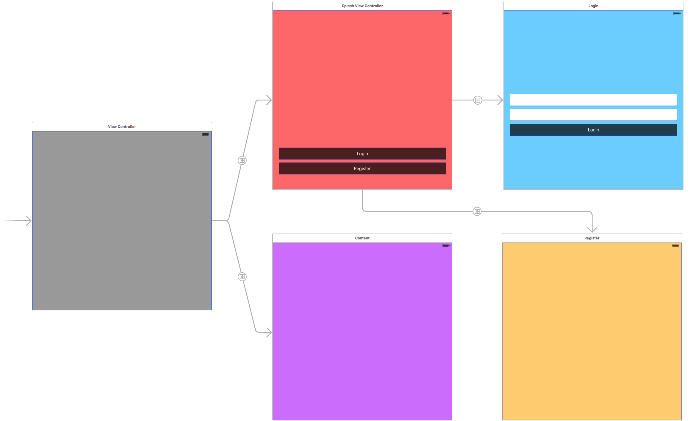

# App Coordinators in iOS


## Responsibilities

### Coordinator
* Navigation Flow
* Model Mutation

### View Controller
* Model-View Binding
* Data Fetching
* User Input

### View
* Subview Allocation
* Layout

### Model
* Data Transformation (ViewModel)

## Notes
* A view controller has an accompanying `coordinator`.
* A view controller declares public `closures` which the coordinator can subscribe to and react accordingly.
* A coordinator has a `navigationController` where a new view controller will spawn from. Can be replaced by any view controller, I suppose.
* A coordinator has a `childCoordinators` array where we hold strong references to child coordinators preventing them from deallocating.
* A coordinator has a `start()` method that instantiates and presents a view controller.
* A coordinator has a `cleanUp()` method that pops the last item from childCoordinators to deallocate.


## Example



### View Controller
```swift
class SplashViewController: UIViewController {

    var didTapLogin: () -> () = {}
    var didTapRegister: () -> () = {}
    var didAppear: () -> () = {}
    
    override func viewDidLoad() {
        super.viewDidLoad()
    }
    
    override func viewWillAppear(animated: Bool) {
        super.viewWillAppear(animated)
    }
    
    override func viewDidAppear(animated: Bool) {
        super.viewDidAppear(animated)
        self.didAppear()
    }
    
    @IBAction func loginButtonTapped(sender: AnyObject) {
        self.didTapLogin()
    }
    
    @IBAction func registerButtonTapped(sender: AnyObject) {
        self.didTapRegister()
    }
}
```

### Coordinator
```swift
class SplashCoordinator: NSObject {

    var navigationController: UINavigationController?
    var childCoordinators: NSMutableArray?
    
    init(navigationController: UINavigationController) {
        super.init()
        self.navigationController = navigationController
        self.childCoordinators = []
    }
    
    func start() {
        let splashViewController = UIStoryboard(name: "Main", bundle: nil).instantiateViewControllerWithIdentifier("SplashViewController") as! SplashViewController
        splashViewController.didTapLogin = showLogin
        splashViewController.didTapRegister = showRegister
        splashViewController.didAppear = cleanUp
        self.navigationController?.pushViewController(splashViewController, animated: false)
    }
    
    func showLogin() {
        let loginCoordinator = LoginCoordinator(navigationController: self.navigationController!)
        loginCoordinator.start()
        self.childCoordinators?.addObject(loginCoordinator)
    }
    
    func showRegister() {
        let registerCoordinator = RegisterCoordinator(navigationController: self.navigationController!)
        registerCoordinator.start()
        self.childCoordinators?.addObject(registerCoordinator)
    }
    
    func cleanUp() {
        if let childCoordinators = self.childCoordinators {
            childCoordinators.removeLastObject()
        }
    }
}
```

## References
* **Coordinators Redux** by [@khanlou](https://twitter.com/khanlou) - http://khanlou.com/2015/10/coordinators-redux/
* **Connecting View Controllers** by [@objcio](https://twitter.com/objcio) - https://talk.objc.io/episodes/S01E05-connecting-view-controllers